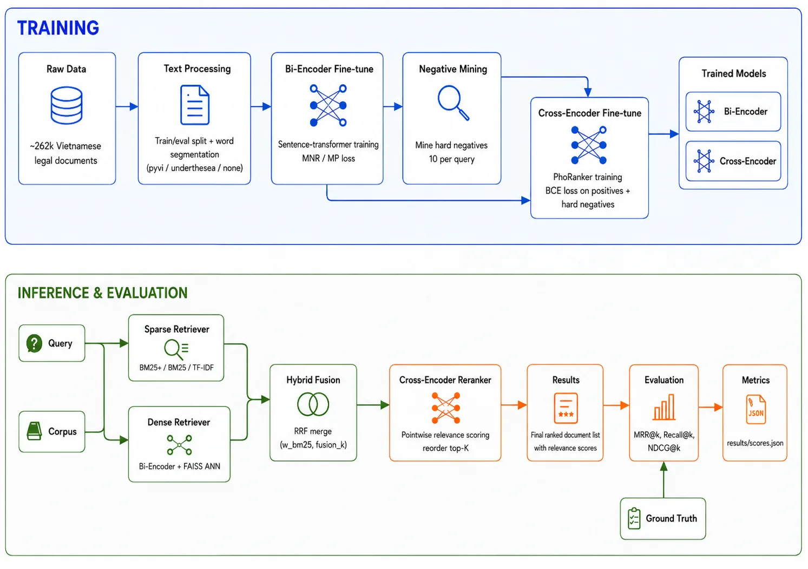
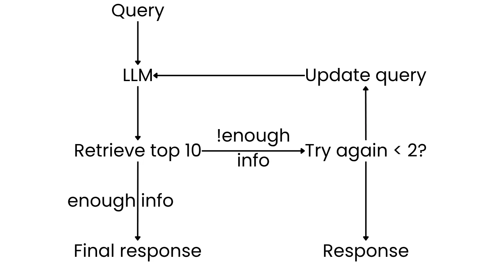

# vnlegal-rag-v2

A modular, config-driven RAG framework for Vietnamese legal document retrieval.
Two-stage pipeline (Bi-Encoder → Cross-Encoder) with hybrid sparse-dense fusion and an agentic chat UI. **MRR@10 = 0.7733** on a ~262k legal corpus.

<p align="center">
  <video src="docs/demo/demo.mp4" controls width="720"></video>
</p>

## Architecture

<p align="center">
  
</p>

The framework is built from independent, swappable blocks with uniform interfaces. Every retriever implements `index(documents, cids)` + `retrieve(queries, top_k)`. Components are wired at runtime by `factory.build_pipeline(config)` — no code changes to swap methods.

- **Retrieval:** HybridRetriever combines BM25+ (sparse, with pyvi/underthesea segmentation) and DenseRetriever (bi-encoder → FAISS) via RRF fusion. Tunable by `w_bm25` and `fusion_k`.
- **Reranking:** CrossEncoderReranker scores each (query, doc) pair through a fine-tuned PhoRanker (pointwise). Chain is extensible.
- **Agentic RAG:** Multi-round loop on top — retrieve, LLM answers with structured citations, reformulate if insufficient.

## Agentic RAG

<p align="center">
  
</p>

## Config-driven pipelines

A single YAML defines retrieval + reranking. Swap methods by editing config — not code.

```yaml
retrieval:
  method: hybrid
  top_k: 100
  params:
    retrievers:
      - method: bm25
        params: { variant: bm25+, segmentation: pyvi, k1: 1.2, b: 0.9 }
      - method: dense
        params: { model_name: phatvucoder/vietnamese-bi-encoder, segmentation: pyvi }
    weights: [0.3, 0.7]
    fusion: rrf
    fusion_kwargs: { k: 10 }

reranking:
  method: cross_encoder
  top_k: 10
  params:
    model_name: phatvucoder/PhoRanker-legal-vn
```

```bash
python scripts/run_pipeline.py configs/pipeline/hybrid_bm25+dense_trained+crossencoder_trained.yaml
```

## Quickstart

```bash
conda env create -f environment.yml
conda activate vnlegal-rag-v2
pip install -e .
python scripts/process_data.py --config configs/data/default.yaml
python scripts/run_pipeline.py configs/pipeline/bm25_only.yaml
```

Full command reference: [USAGE.md](USAGE.md)

## Experiments

All experiments are config-driven and logged to `results/scores.json` (224 total).

### 1. Data processing
Raw documents are split into train/eval (`eval_size: 0.1`) and optionally word-segmented (pyvi / underthesea / none). Segmented variants are cached.

### 2. Sparse retrieval baselines
BM25, BM25+, and TF-IDF are evaluated across all segmentation methods with hyperparameter sweeps (`k1`, `b`, `delta`). Pyvi segmentation boosts MRR@10 by ~8-10%. Best sparse: BM25+ `k1=1.0, b=0.9, pyvi` — MRR@10 = **0.3928**, locked for hybrid experiments.

### 3. Zero-shot dense model selection
Eleven bi-encoder models compared without fine-tuning:

| Model | Size | MRR@10 |
|---|---|---|
| `embeddinggemma-300m` | 300M | **0.4730** |
| `vietnamese-bi-encoder` | ~110M | 0.4615 |
| `multilingual-e5-base` | 110M | 0.4115 |
| `granite-embedding-97m` | 97M | 0.4076 |

### 4. Bi-encoder fine-tuning
Four models fine-tuned with MNR/MP loss and variable batch sizes. The Vietnamese model (`vietnamese-bi-encoder`, MP, bs512) achieves the best score: **0.6372** (+38% vs. zero-shot). Larger batch sizes consistently improve results. Multilingual models show higher relative gains (+48-49%) but lag in absolute score.

### 5. Hybrid retrieval tuning
Sweep `w_bm25 ∈ [0.0, 1.0]` × `fusion_k ∈ {5, 10, 20, 30, 60, 100}` (66 experiments). Even a small BM25 weight (0.1-0.3) improves over pure dense. Best hybrid retrieval: MRR@10 = **0.6288** at `w_bm25=0.2, fusion_k=5`.

```bash
python scripts/tune_hybrid.py --config configs/hybrid-tuning/hybrid_sweep.yaml
```

### 6. Cross-encoder training
Hard negatives (n=10) are mined using the trained bi-encoder, then used to fine-tune PhoRanker with pointwise BCE loss:

```bash
python scripts/mine_negatives.py --config configs/data/negative_mining.yaml
python scripts/train_cross.py --config configs/train/cross_encoder_phranker.yaml
```

### 7. Cross-encoder reranking

| Experiment | MRR@10 | Recall@10 |
|---|---|---|
| Best retrieval only | 0.6288 | — |
| + Cross-encoder (dense candidates) | **0.7725** | 0.9098 |
| + Cross-encoder (hybrid candidates) | **0.7733** | 0.9041 |

The cross-encoder adds ~21% MRR@10, bringing the system within 0.2 pp of the reference (MRR@10 = 0.7754).

Interactive leaderboard: `python results/leaderboard/build.py` → http://localhost:8787

## Project Structure

```
├── app/                    # FastAPI chat app (UI + API)
├── configs/                # YAML configs (data/ train/ pipeline/ model-selection/ app/)
├── scripts/                # CLI entry points
├── src/vnlegal_rag_v2/     # Core library
│   ├── retrieval/          # BM25, TF-IDF, Dense, Hybrid
│   ├── reranking/          # Cross-encoder
│   ├── training/           # Training loops + loss functions
│   ├── evaluation/         # MRR, NDCG, Recall, Success
│   ├── mining/             # Hard negative mining
│   ├── rag/                # Agentic RAG loop + LLM client
│   ├── data/               # Data loading & processing
│   ├── utils/              # Device, text segmentation, I/O
│   ├── factory.py          # Config → pipeline builder
│   └── pipeline.py         # RAGPipeline orchestrator
├── results/                # 224 experiments, leaderboard
└── docs/demo/demo.mp4
```

## Reference

```bibtex
@misc{nguyen2024legal,
  title={Legal Document Retrieval for Vietnamese Law: A Benchmark and Method Comparison},
  author={Nguyen, Quang H. and Pham, Hoang and Nguyen, Trung and Le, Minh},
  year={2024},
  eprint={2507.14619},
  archivePrefix={arXiv},
  primaryClass={cs.IR},
  url={https://arxiv.org/abs/2507.14619}
}
```

## License

MIT — see [LICENSE](LICENSE).
